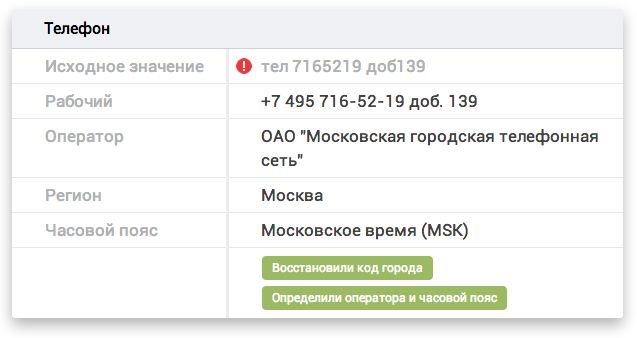

API DaData.ru для C# / .NET
====================

Описание
---------------

Библиотека `dadata-csharp` — это обертка над [API стандартизации](https://dadata.ru/api/clean/) DaData.ru для C# и других .NET-языков.



Установка
---------

### 1. Подключите библиотеку

Прежде всего, скачайте [бинарники](https://github.com/hflabs/dadata-csharp/releases/tag/16.10) и подключите их к своему проекту.

Внешние зависимости:

- [JSON.NET](http://james.newtonking.com/json)
- [NUnit](http://www.nunit.org/) (для тестов)


### 2. Получите API-ключи

Зарегистрируйтесь на [dadata.ru](https://dadata.ru) и получите API-ключи в [личном кабинете](https://dadata.ru/profile/#info).

### 3. Пользуйтесь API!

Примеры вызова API смотрите в юнит-тестах (`CleanClientTest`) или ниже по тексту.

Использование
---------

Поддерживается обработка следующих типов данных:

- ФИО
- Паспорт
- Почтовые адреса
- Телефоны
- Email
- Даты
- Автомобили

Если вы обрабатываете однотипные данные (например, только адреса), то удобно воспользоваться методом `CleanClient.Clean<T>(IEnumerable<string> inputs)`:

```csharp
var api = new CleanClient("REPLACE_WITH_YOUR_API_KEY", "REPLACE_WITH_YOUR_SECRET_KEY", "dadata.ru", "https");
var inputs = new string[] { "Москва Милютинский 13", "Питер Восстания 1" };
var cleaned = api.Clean<AddressData>(inputs);
foreach (AddressData entity in cleaned) {
    Console.WriteLine(entity);
}
```

Если вы хотите получать поля объекта (например, kladr_id), используйте метод так:

```csharp
var api = new CleanClient("REPLACE_WITH_YOUR_API_KEY", "REPLACE_WITH_YOUR_SECRET_KEY", "dadata.ru", "https");
var inputs = new string[] { "Москва Милютинский 13", "Питер Восстания 1" };
var cleaned = api.Clean<AddressData>(inputs);
foreach (AddressData address in cleaned) {
    Console.WriteLine(address.kladr_id);
}
```

Если вы обрабатываете записи, каждая из которых содержит данные нескольких типов (например, ФИО и телефоны), то больше подойдет метод `CleanClient.Clean(CleanRequest request)`:

```csharp
var api = new CleanClient("REPLACE_WITH_YOUR_API_KEY", "REPLACE_WITH_YOUR_SECRET_KEY", "dadata.ru", "https");
var structure = new List<StructureType>(
    new StructureType[] { StructureType.NAME, StructureType.PHONE }
);

var data = new List<List<string>>(new List<string>[] {
    new List<string>(new string[] { "Кузнецов Петр Алексеич", "8916 82345.34" }),
    new List<string>(new string[] { "Марципанова Ольга Викторовна", null }),
    new List<string>(new string[] { "Пузин Витя", null })
});

var request = new CleanRequest(structure, data);
var cleanedRecords = api.Clean(request).data;
```
